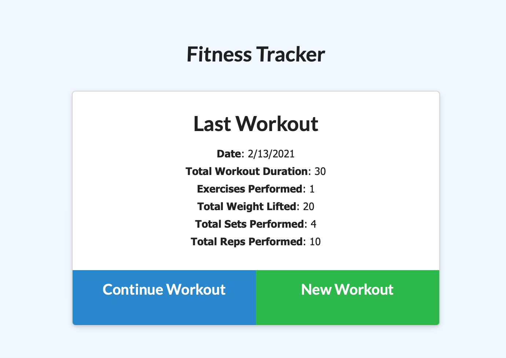

<h1 align="center">Fitness Tracker</h1>



Click [here](https://fitness-tracker-ibarrasb.herokuapp.com/?id=60283576d8272b0015782fb4) to launch App.

<br />
## Description
🔍 Manage your daily workouts with one simple application! Where you can create some workouts of your own, or continue with previous workouts youve already done. This application also allows you to track your progress with charts and can be updated daily!
## Table of Contents
- [Description](#description)
- [License](#license)
- [Installation](#Installation)
- [Contributing](#contributing)

## Installation
```
npm install 
```
## Usage

``` 
node server.js 
```
``` 
npm start
```

## License

<br />
This application is covered by the MIT license. 
## Contributing
Eddie Ibarra
<br />
:octocat: Find me on GitHub: [ibarrasb](https://github.com/ibarrasb)<br />
<br />
✉Email me with any questions: eddieibarra43@gmail.com<br /><br />

    
